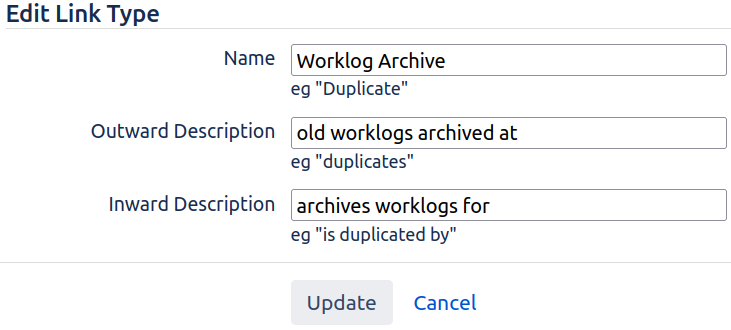
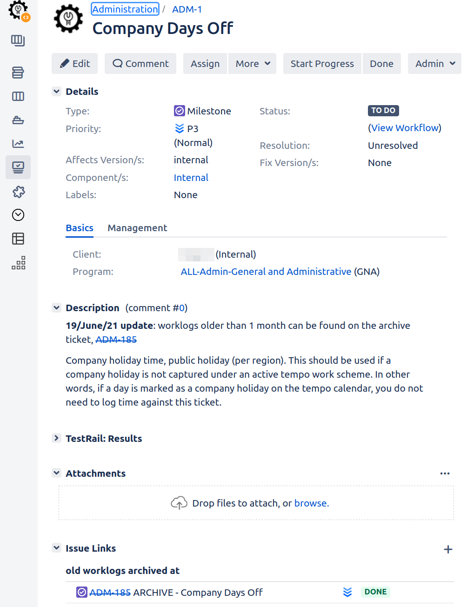
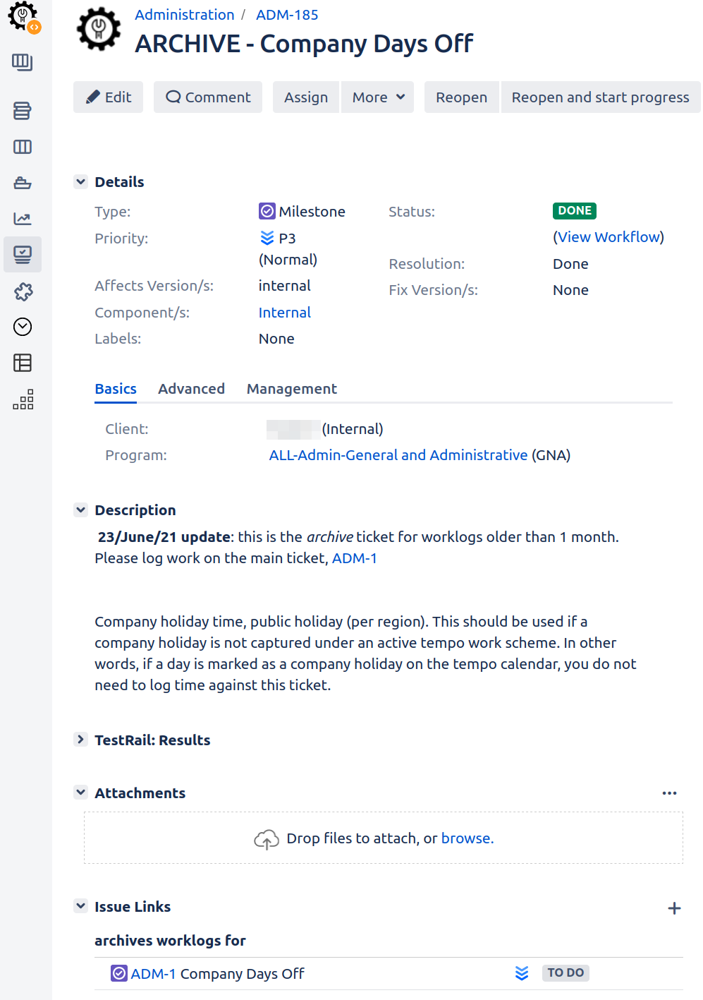

# Jira Worklog Archiver

[worklog_archiver.sql](worklog_archiver.sql) is a PL/pgSQL script for Postgres which moves excessive worklogs from a Jira Server issue to another, linked, 'archive' issue, in order to prevent Jira (notably the Tempo app) from slowing down as it tries to process large numbers of worklogs.

# Background
## The effect of too many worklogs per issue

Say your company uses Jira for time tracking purposes - perhaps with [Tempo](https://www.tempo.io). A common pattern is to have issues specifically to log time against:

- Meetings and communication
- General administration
- Internal documentation
- Training and knowledge development
- Personal time off
- Company days off

This works, but in a large company, over many years, such issues can accumulate thousands of worklogs.

In one instance, the primary 'meetings and communication' issue accumulated 59,000+ worklogs, and the following problems were observed:

- Logging time in Tempo would take 1-3 minutes. In the access logs this was evidenced as POSTs to ``/rest/tempo-timesheets/4/worklogs/`` taking up to 200s to complete.
- Issue actions (creating, commenting, editing, assigning, adding worklogs) would sometimes hang for 30 seconds before failing, and the logs would contain an index timeout error:
    ```angular2html
    2021-06-16 14:38:04,079-0700 ajp-nio-127.0.0.101-8009-exec-44 url:/rest/tempo-timesheets/4/worklogs/ username:jefft ERROR PagerDuty 877x19012904x2 kme1ii 206.80.4.66 /rest/tempo-timesheets/4/worklogs/ [c.a.j.issue.index.DefaultIndexManager] Wait attempt timed out - waited 30000 milliseconds
    com.atlassian.jira.issue.index.IndexException: Wait attempt timed out - waited 30000 milliseconds
            at com.atlassian.jira.issue.index.DefaultIndexManager.obtain(DefaultIndexManager.java:872)
            at com.atlassian.jira.issue.index.DefaultIndexManager.await(DefaultIndexManager.java:843)
            at com.atlassian.jira.issue.index.DefaultIndexManager.executeWithIndexLock(DefaultIndexManager.java:830)
            at com.atlassian.jira.issue.index.DefaultIndexManager.reIndexIssues(DefaultIndexManager.java:618)
            at com.atlassian.jira.issue.index.DefaultIndexManager.reIndexIssueObjects(DefaultIndexManager.java:494)
            at com.atlassian.jira.issue.index.DefaultIndexManager.reIndex(DefaultIndexManager.java:540)
            at com.atlassian.jira.issue.index.DefaultIndexManager.reIndex(DefaultIndexManager.java:523)
            at jdk.internal.reflect.GeneratedMethodAccessor1324.invoke(Unknown Source)
    ....
    
    ```
- A thread dump taken during periods of 'slowness' invariably showed the WORKLOG index queue thread in RUNNABLE status, actively doing something with Lucene:
  ```angular2html
    "WORKLOG-indexQueue:thread-1" #551 prio=10 os_prio=0 cpu=134131153.03ms elapsed=2372883.14s allocated=61439G defined_classes=19 tid=0x00007f9c24421000 nid=0x655 runnable  [0x00007f9c956db000]
    java.lang.Thread.State: RUNNABLE
    at java.util.Arrays.copyOf(java.base@11.0.10/Arrays.java:3793)
    at org.apache.lucene.util.DocIdSetBuilder.growBuffer(DocIdSetBuilder.java:229)
    at org.apache.lucene.util.DocIdSetBuilder.ensureBufferCapacity(DocIdSetBuilder.java:200)
    at org.apache.lucene.util.DocIdSetBuilder.grow(DocIdSetBuilder.java:176)
    at org.apache.lucene.search.PointRangeQuery$1$1.grow(PointRangeQuery.java:116)
    at org.apache.lucene.util.bkd.BKDReader.addAll(BKDReader.java:537)
    at org.apache.lucene.util.bkd.BKDReader.intersect(BKDReader.java:699)
    at org.apache.lucene.util.bkd.BKDReader.intersect(BKDReader.java:744)
    at org.apache.lucene.util.bkd.BKDReader.intersect(BKDReader.java:734)
    at org.apache.lucene.util.bkd.BKDReader.intersect(BKDReader.java:744)
    at org.apache.lucene.util.bkd.BKDReader.intersect(BKDReader.java:744)
    at org.apache.lucene.util.bkd.BKDReader.intersect(BKDReader.java:734)
    at org.apache.lucene.util.bkd.BKDReader.intersect(BKDReader.java:744)
    at org.apache.lucene.util.bkd.BKDReader.intersect(BKDReader.java:734)
    at org.apache.lucene.util.bkd.BKDReader.intersect(BKDReader.java:744)
    at org.apache.lucene.util.bkd.BKDReader.intersect(BKDReader.java:744)
    at org.apache.lucene.util.bkd.BKDReader.intersect(BKDReader.java:522)
    at org.apache.lucene.search.PointRangeQuery$1$4.get(PointRangeQuery.java:298)
    at org.apache.lucene.search.Boolean2ScorerSupplier.req(Boolean2ScorerSupplier.java:148)
    at org.apache.lucene.search.Boolean2ScorerSupplier.get(Boolean2ScorerSupplier.java:92)
    at org.apache.lucene.search.BooleanWeight.scorer(BooleanWeight.java:299)
    at org.apache.lucene.search.Weight.bulkScorer(Weight.java:147)
    at org.apache.lucene.search.BooleanWeight.bulkScorer(BooleanWeight.java:289)
    at org.apache.lucene.search.IndexSearcher.search(IndexSearcher.java:657)
    at org.apache.lucene.search.IndexSearcher.search(IndexSearcher.java:462)
    at org.apache.lucene.search.IndexSearcher.search(IndexSearcher.java:583)
    at org.apache.lucene.search.IndexSearcher.searchAfter(IndexSearcher.java:439)
    at org.apache.lucene.search.IndexSearcher.search(IndexSearcher.java:450)
    at com.atlassian.jira.index.DelegateSearcher.search(DelegateSearcher.java:164)
    at com.atlassian.jira.index.DelegateSearcher.search(DelegateSearcher.java:164)
    at com.atlassian.jira.index.UnmanagedIndexSearcher.search(UnmanagedIndexSearcher.java:9)
    at com.atlassian.jira.index.ReusableIndexSearcher.search(ReusableIndexSearcher.java:45)
    at com.atlassian.jira.index.WriterWrapper.updateDocumentsWithVersion(WriterWrapper.java:197)
    at com.atlassian.jira.index.WriterWithStats.updateDocumentsWithVersion(WriterWithStats.java:182)
    at com.atlassian.jira.index.Operations$ConditionalUpdateWithVersion.perform(Operations.java:243)
    at com.atlassian.jira.index.QueueingIndex$CompositeOperation.perform(QueueingIndex.java:363)
    at com.atlassian.jira.index.DefaultIndexEngine$FlushPolicy.perform(DefaultIndexEngine.java:76)
    at com.atlassian.jira.index.DefaultIndexEngine.write(DefaultIndexEngine.java:142)
    at com.atlassian.jira.index.DefaultIndex.perform(DefaultIndex.java:28)
    at com.atlassian.jira.index.QueueingIndex$Task.perform(QueueingIndex.java:215)
    - locked <0x0000000692584a88> (a com.atlassian.jira.index.QueueingIndex$Task)
    at com.atlassian.jira.index.QueueingIndex$Task.index(QueueingIndex.java:226)
    at com.atlassian.jira.index.QueueingIndex$Task.run(QueueingIndex.java:194)
    at java.lang.Thread.run(java.base@11.0.10/Thread.java:834)
    
    Locked ownable synchronizers:
    - None
  ```

# Worklog index contention

What is going wrong? The problem is contention for write locks on the WORKLOG lucene index. Reindexing an issue with 59k worklogs takes a while, during which all other threads wanting to alter the index are blocked. Even reindexes not involving worklogs block, because a simple ``IssueIndexManager.reIndex()`` reindexes worklogs ([JRASERVER-72469](https://jira.atlassian.com/browse/JRASERVER-72469)).

And don't plugins just _love_ to call reindex. It seems that many plugin developers are skeptical of Jira's ability to keep its indexes up-to-date, and think nothing of invoking a ``reIndex()`` just in case, to ensure the current issue is up-to-date. When ``reIndex()`` takes 50ms this might not matter. But when your indexing queue is backlogged, a needless ``reIndex()`` request blocks, and then 30 seconds later times out.

Specifically:
- the [Customer Satisfaction for Jira](https://marketplace.atlassian.com/apps/1215212/customer-satisfaction-survey-for-jira?hosting=server&tab=overview) plugin prior to version 4.7.2 would trigger a reindex on every page load:
  ```
   ...  at com.sun.proxy.$Proxy2866.reIndex(Unknown Source)
        at com.candylio.jira.plugins.csat.util.IssueIndexingHelper.reindexIssue(IssueIndexingHelper.java:26)
        at com.candylio.jira.plugins.csat.util.CsatIssueValidationHelper.validateGlobal(CsatIssueValidationHelper.java:46)
        at com.candylio.jira.plugins.csat.util.CsatInContextValidator.validate(CsatInContextValidator.java:55)
        at com.candylio.jira.plugins.csat.service.RatingContextServiceImpl.showRatingSection(RatingContextServiceImpl.java:36)
        at com.candylio.jira.plugins.csat.web.conditions.ShowInContextRatingSectionCondition.shouldDisplay(ShowInContextRatingSectionCondition.java:41)
  ```
  To their credit the CSAT author fixed this within 24h of my bug report.
- The [PagerDuty plugin](https://marketplace.atlassian.com/apps/1218226/pagerduty-for-jira-server-data-center?hosting=datacenter&tab=overview) version 4.2.3.0 listens to every event, and then calls ``reIndex()`` before considering whether it needs to take any action:
  ```    
  at com.sun.proxy.$Proxy1845.reIndex(Unknown Source)
  at com.pagerduty.jira.listeners.IssueListener.createNewIncidentIfNeeded(IssueListener.java:106)
  at com.pagerduty.jira.listeners.IssueListener.onIssueEvent(IssueListener.`java:88)
  ```
  This needless ``reIndex()`` puts the slow index on the critical path for most operations. I am waiting for a response to my ticket, and will update this README when I do.


## Indexing statistics


If you are having Jira index contention problems, don't bother doing any debugging until you have upgraded to 8.13.6 / 8.16.x. Partly because these versions fix a critical bug [JRASERVER-72045](https://jira.atlassian.com/browse/JRASERVER-72045), but mainly because 8.13.x introduced [index statistics logging](https://confluence.atlassian.com/jirakb/jira-indexing-queue-1047541818.html), which gives you a fighting chance. Index stats appear every 10 minutes as ``[JIRA-STATS] [INDEXING-QUEUE]`` lines of JSON in ``atlassian-jira.log``. Here is a line of stats piped through ``jq``:

```json5
  {
  "maxQueueSize": 7,            // biggest queue size we have seen
  "putCounter": 77,             // number of puts
  "queueFullOnPut": 0,          // number of puts which had to wait because the queue was full
  "getCounter": 79,             // number of consumed index operations
  "timeInQueueMillis": {                // time of index operation spent in queue
    "count": 79,
    "min": 0,
    "max": 53722,
    "sum": 280892,
    "avg": 3555,
    "distributionCounter": {
      "0": 55,
      "1": 2,
      "10": 0,
      "100": 2,
      "1000": 1,
      "10000": 11,
      "20000": 0,
      "30000": 5,
      "9223372036854775807": 3
    }
  },
  "timeToUpdateIndexMillis": {          // time of index operation being applied to index
    "count": 80,
    "min": 0,
    "max": 33004,
    "sum": 112681,
    "avg": 1408,
    "distributionCounter": {
      "0": 52,
      "1": 3,
      "10": 10,
      "50": 1,
      "100": 1,
      "500": 5,
      "1000": 1,
      "9223372036854775807": 7
    }
  },
  "totalTimeMillis": {          // total time: from putting to queue until getting result
    "count": 76,
    "min": 0,
    "max": 29324,
    "sum": 218654,
    "avg": 2877,
    "distributionCounter": {
      "0": 31,
      "1": 8,
      "10": 6,
      "100": 7,
      "1000": 4,
      "10000": 14,
      "20000": 0,
      "30000": 6
    }
  },
  "totalTimeFailedMillis": {            // total time: from putting to queue until failed result
    "count": 0,
    "min": 0,
    "max": 0,
    "sum": 0,
    "avg": 0,
    "distributionCounter": {}
  },
  "totalTimeTimedOutMillis": {          // total time: from putting to queue until timeout result
    "count": 4,
    "min": 30001,
    "max": 30002,
    "sum": 120006,
    "avg": 30001,
    "distributionCounter": {}
  },
  "putCounterByThreadTopN": {           // top N threads sorted by number of puts descending, primary queue so these are all HTTP threads
    "ajp-nio-127.0.0.101-8009-exec-20 url:/secure/QuickCreateIssue.jspa username:jteller": 3,
    "ajp-nio-127.0.0.101-8009-exec-42 url:/secure/CommentAssignIssue.jspa username:dnichols": 3,
    "ajp-nio-127.0.0.101-8009-exec-45 url:/secure/CommentAssignIssue.jspa username:amalone": 3,
    "ajp-nio-127.0.0.101-8009-exec-66 url:/rest/tempo-timesheets/4/worklogs/ username:sash": 3,
    "ajp-nio-127.0.0.101-8009-exec-15 url:/rest/tempo-tim.../worklogs/1325190/ username:dmalak": 2,
    "ajp-nio-127.0.0.101-8009-exec-19 url:/rest/tempo-tim.../worklogs/1325189/ username:johnk": 2,
    "ajp-nio-127.0.0.101-8009-exec-2 url:/rest/tempo-timesheets/4/worklogs/ username:johnk": 2,
    "ajp-nio-127.0.0.101-8009-exec-22 url:/rest/tempo-tim.../worklogs/1325202/ username:johnk": 2,
    "ajp-nio-127.0.0.101-8009-exec-23 url:/rest/tempo-tim.../worklogs/1325204/ username:johnk": 2,
    "ajp-nio-127.0.0.101-8009-exec-27 url:/rest/tempo-tim.../worklogs/1325208/ username:johnk": 2
  },
  "indexerNotRunningCounter": 0
}

```

For instance, the ``totalTimeTimedOutMillis`` block shows that in the last 10 minutes, 4 threads timed out after 30s waiting for the worklog index to clear. The ``totalTimeMillis`` section shows the average thread waited 2877ms on the index. Pretty poor!

Other required reading:

- https://jira.atlassian.com/browse/JRASERVER-72045
- https://confluence.atlassian.com/jirakb/troubleshooting-performance-with-jira-stats-1041829254.html


# Archiving old worklogs

While we can complain about plugins essentially turning Jira into a single-threaded wait-for-Lucene experience, all we can realistically do is reduce the number of worklogs on issues that will be reindexed (legitimately or otherwise).


The workaround is as follows:

- Define a Jira Link Type called *Worklog Archive*:
  



For each issue with "too many" worklogs:

- Clone the issue (excluding links), giving the clone an ``ARCHIVE - ``` prefix.
- Link the ARCHIVE clone to the parent with an *archives worklogs for* link.
- Close the ARCHIVE clone to prevent work being logged on it, and perhaps add a comment to the description noting that it is just an archive.
  
- On the parent issue, add a note to the description telling users to check the archive for worklogs older than 1 month.

Your issues will now look something like this:


| Source issue | Archive issue |
|--------------|---------------|
|  |  |
  
- In a ``psql`` prompt to Jira's database, run [worklog_archiver.sql](worklog_archiver.sql). Output will be something like:
```sql
NOTICE:  ADM-6 has 56023 worklogs (over the 10,000 limit). Checking if some can be moved to archive issue ADM-181
DEBUG:  building index "pg_toast_10070116_index" on table "pg_toast_10070116" serially
NOTICE:  There are 51699 worklogs that need copying from ADM-6 to ADM-181
NOTICE:  Copied 56023 worklogs from ADM-6 to ADM-181, adjusting issue worklog times by 39518345 seconds
NOTICE:  ADM-7 has only 4157 worklogs
NOTICE:  ADM-9 has only 1770 worklogs
NOTICE:  ADM-2 has only 1709 worklogs
NOTICE:  ADM-1 has only 3736 worklogs
```

This can be run by hand at first, but needs to be run automatically (e.g. via cron) once a day to keep worklogs in check.

The [worklog_archiver.sql](worklog_archiver.sql) SQL is quite simple. It finds all issues with an 'old worklogs archived at' outgoing link, having more than 10,000 worklogs, and moves worklogs older than 1 month to the linked archive issue, by updating ``worklog.issueid``.

Normally messing with Jira's database directly is not healthy, but worklogs are not cached by Jira or any plugin I know of, and because the worklog ``id`` remains unchanged, referential integrity from other tables (like Tempo's worklog attributes) is preserved.

You should of course understand any SQL you run in production, test it yourself and take backups before running in production.

**Shameless plug** - [the author](https://www.redradishtech.com) is a consultant available for hire to diagnose and fix gnarly Jira performance problems.